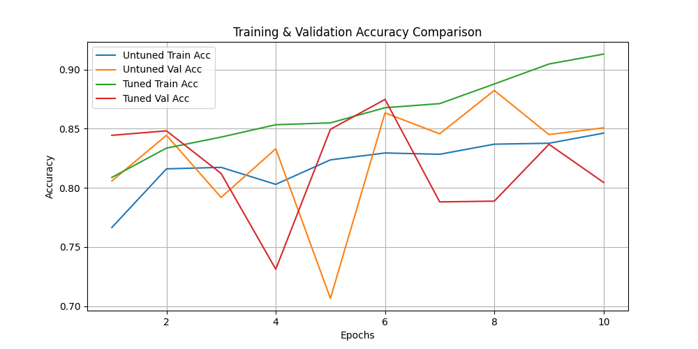
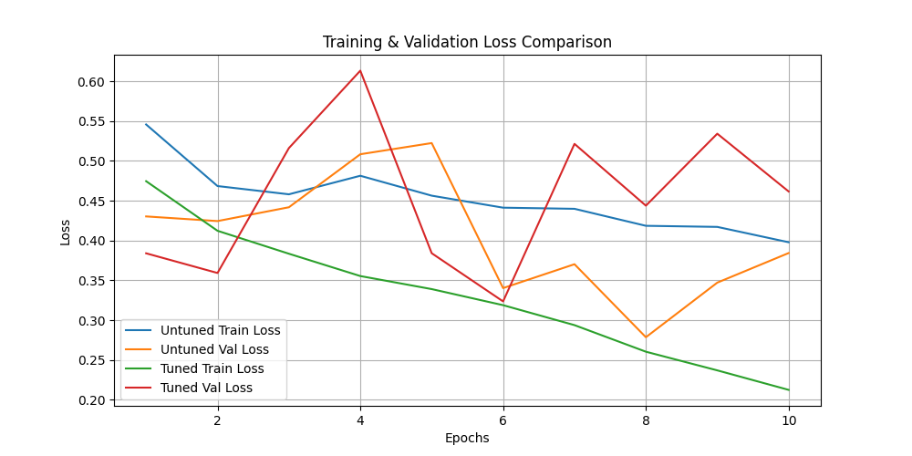
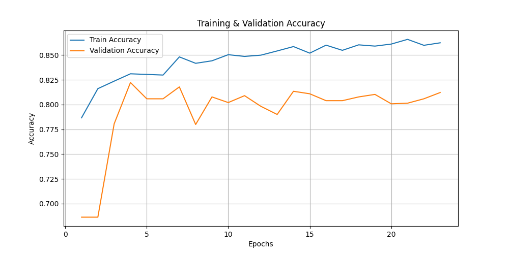
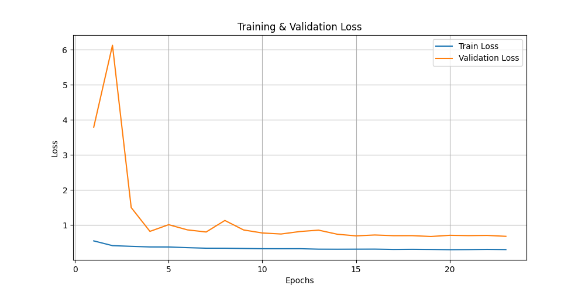

# 🩺 Breast Cancer Classification Using CNN  
A deep learning–based breast cancer detection model trained on the **Breast Histopathology Images** dataset from Kaggle.  
The project compares four different CNN training strategies (Untuned, Tuned, Earlier Optimized, Final Optimized) to analyze accuracy, loss, and overfitting levels.

---

## 📌 Dataset Information  
This project uses the publicly available **Breast Histopathology Images Dataset** from Kaggle.

### 🔗 Dataset Source  
**Kaggle Link:**  
https://www.kaggle.com/paultimothymooney/breast-histopathology-images

### 📂 Dataset Details  
- **Total Images:** 277,524 patches  
- **Two Classes:**  
  - `0` → Benign  
  - `1` → Malignant  
- All images are **50×50 RGB**  
- Only a balanced subset was used due to storage/computation limits.  
- Dataset was divided into:  
  - **70% Training**  
  - **20% Validation**  
  - **10% Testing**

---

## 🎯 Project Objective  
To build a high-accuracy, low-overfitting CNN model for breast cancer classification and compare the performance of four different model training strategies:

1. **Untuned Model**  
2. **Tuned Model**  
3. **Earlier Optimized Model**  
4. **Final Optimized Model**

---

## 🧠 Models Overview  
Each model was trained with different hyperparameters, augmentation settings, and optimizers to analyze their impact on:

- Accuracy  
- Validation behavior  
- Overfitting  
- Generalization  

---

## 📊 Model Performance Comparison  

| **Model Type**         | **Test Loss** | **Test Accuracy** | **Overfitting Level** |
|------------------------|--------------|-------------------|------------------------|
| Untuned                | 40%          | 84.75%            | High                   |
| Tuned                  | 30%          | 85.87%            | Very High              |
| Earlier Optimized      | 48%          | 79.37%            | Low                    |
| Final Optimized        | 54%          | 82.63%            | Low                    |

---

## 🏆 Final Results  
Although one model achieved the highest accuracy, it also showed **very high overfitting**.  
The **Final Optimized Model** offered the best balance between:

✔ Stable validation accuracy  
✔ Low overfitting  
✔ Good generalization  
✔ Better behavior on unseen data  

---

## 🖼 Accuracy & Loss Visualizations  

### 🔹 Untuned & Tuned Comparison  
**Accuracy Curve:**  

**Loss Curve:**  

---

### 🔹 Final Optimized Model  
**Accuracy Curve:**  

**Loss Curve:**  

---

---

## ⚙ Features Implemented  
- Image preprocessing  
- Data balancing  
- Data augmentation  
- CNN architecture development  
- Training with callbacks (EarlyStopping, ReduceLROnPlateau)  
- Overfitting analysis  
- Accuracy & loss visualization  
- Comparison across four models  
